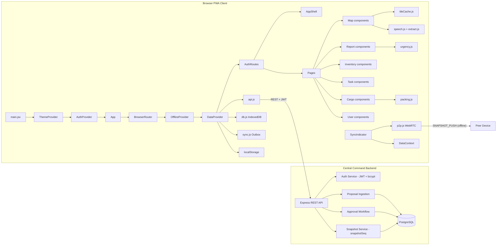

# Software Requirements Specification

## ReliefOpt — Disaster Relief Coordination Platform

| Field | Value |
|---|---|
| **Document** | Software Requirements Specification (SRS) |
| **Project** | ReliefOpt |
| **Version** | 2.3 |
| **Date** | 2026-08-25 |
| **Status** | Implemented baseline with separately tracked validation gaps |
| **Standard** | IEEE 830 / ISO/IEC/IEEE 29148 |
| **Platform** | Client-server Progressive Web App (PWA), offline-first |

> **Conformance note on markers.** This SRS specifies the **target architecture**
> for ReliefOpt: a browser PWA client backed by a **Central Command server** that
> is the single source of truth. Statements are qualified by:
>
> - `[IMPLEMENTED]` — verified present in current source.
> - `[INFERRED]` — intent read from code without an explicit specification.
> - `[PLANNED]` — part of the target architecture but not yet (or not fully)
>   present in code.
>
> Implementation status is descriptive rather than normative. Requirement text
> defines the target; Section 8.2 records current status and evidence separately.
>
> The synchronization sections (3.14–3.19) describe the agreed
> **Central-Command-Authoritative, Snapshot-Propagated Synchronization** model and
> the architectural decisions that resolve its edge cases.

---

## 1. Introduction

### 1.1 Purpose

This document specifies the software requirements for **ReliefOpt**, a map-based,
role-driven disaster relief coordination dashboard for Bangladesh. ReliefOpt lets
relief workers file emergency reports (including by English voice input), track
inventory across warehouses, manage response tasks, optimise cargo packing, and
continue operating when connectivity is unavailable.

The intended audience is the development team, course examiners, and any engineer
who needs to understand exactly what the system is required to do and how it is
built.

### 1.2 Scope

ReliefOpt is a **client-server Progressive Web App**. A browser PWA client
communicates with a **Central Command backend server** that is the single source
of truth (SSoT). Each client device maintains a local IndexedDB cache of the
authoritative snapshot plus a local outbox of pending proposals.

**What the system does:**

- Role-based authentication with three roles, handled by the backend.
- Role-gated navigation and feature access, enforced on the client and validated
  on the backend.
- An operations dashboard with KPIs, alerts, and analytics charts.
- A Leaflet map with categorised markers, filters, and voice-report pinning.
- Emergency report filing, listing, filtering, sorting, and status management.
- Inventory and stock-history management across warehouses.
- A Kanban task board for field-team coordination.
- A cargo packing optimiser with a visual placement plan and export.
- User and team management.
- Notifications.
- Online management mode (connected to Central Command) and offline degraded
  mode (local cache + proposal outbox).
- Local, English-only Whisper speech-to-text reporting with structured district
  and disaster-field extraction.
- Peer-to-peer snapshot relay over WebRTC for offline environments.
- Central-Command-Authoritative, Snapshot-Propagated synchronization (see
  Sections 3.14–3.19).

**What the system explicitly does *not* do:**

- It does not allow field nodes to commit authoritative state directly; field
  mutations are proposals pending Central Command approval. `[IMPLEMENTED]`
- It does not provide peer discovery, STUN/TURN connectivity, or a WebRTC
  signalling service. Peer connections are same-device or manual copy/paste.
- It does not merge proposals peer-to-peer; P2P is snapshot-only and used only
  as a degraded offline fallback.
- It does not provide Bangla or Banglish speech-to-text, translation,
  transliteration, a speech-language selector, or browser-native speech
  recognition. Voice transcription is English-only and model-based.
- It does not enforce TypeScript-level type safety (plain JavaScript is used).

### 1.3 Definitions, Acronyms, and Abbreviations

| Term | Definition |
|---|---|
| **PWA** | Progressive Web Application — installable, offline-capable web app |
| **IndexedDB** | The browser's built-in object database used as the client's local cache and outbox store |
| **localStorage** | Synchronous browser key-value storage used for session, theme, and a state shadow |
| **WebRTC** | Browser API for real-time peer-to-peer data connections |
| **RTCPeerConnection** | The WebRTC object representing a peer connection |
| **RTCDataChannel** | A bidirectional data channel established between two peers |
| **P2P** | Peer-to-peer — direct device-to-device communication |
| **SDP** | Session Description Protocol — the handshake blob exchanged to establish a WebRTC connection |
| **ICE** | Interactive Connectivity Establishment — the process of gathering connection candidates |
| **Service Worker** | Background script that enables offline asset caching and app-shell loading |
| **OSM** | OpenStreetMap |
| **RBAC** | Role-Based Access Control |
| **KPI** | Key Performance Indicator |
| **Central Command** | The backend server (Node.js + Express + PostgreSQL) that is the authoritative source of truth and publishes snapshots |
| **Snapshot** | A point-in-time copy of authoritative shared state carrying a monotonic `snapshotSeq` |
| **Proposal** | A field-device mutation held locally until Central Command accepts or rejects it |
| **Outbox** | The device-local queue of pending proposals that are never shared peer-to-peer |
| **SSoT** | Single Source of Truth — Central Command's PostgreSQL-backed authoritative state |
| **JWT** | JSON Web Token — the signed access token issued by Central Command on login |
| **snapshotSeq** | The monotonically increasing server-assigned sequence number that orders snapshots |
| **Whisper** | The English-only speech-to-text model (`Xenova/whisper-base.en`) used for local transcription |

### 1.4 References

The following files are the authoritative sources for the current client code:

- `package.json` — dependencies, scripts, and project metadata.
- `vite.config.js` — build configuration and PWA plugin settings.
- `index.html` — application shell and manifest linkage.
- `public/manifest.json` — PWA manifest.
- `src/routes.js` — route constants.
- `src/App.jsx` — routing and provider composition.
- `src/main.jsx` — application entry point.
- `src/context/` — `AuthContext`, `DataContext`, `OfflineContext`, `ThemeContext`.
- `src/lib/` — `db.js`, `sync.js`, `p2p.js`, `urgency.js`, `packing.js`,
  `speech.js`, `speechAudio.js`, `extract.js`, `districts.js`, `disasters.js`,
  `tileCache.js`, `contracts.js`, `utils.js`.
- `src/mockData.js` — seed/demo data and domain entity shapes.
- `src/components/` and `src/pages/` — UI and route-level components.

The backend (`server/`) is implemented and contains Express routes, PostgreSQL
migrations, authentication, user administration, synchronization, and tests.

### 1.5 Overview of Document

The remainder of this document is organised as follows:

- Section 2 — Overall Description.
- Section 3 — System Features and Functional Requirements.
- Section 4 — External Interface Requirements.
- Section 5 — Non-Functional Requirements.
- Section 6 — Data Requirements.
- Section 7 — System Architecture Summary.
- Section 8 — Appendices (traceability and open questions).

---

## 2. Overall Description

### 2.1 Product Perspective

ReliefOpt is a **client-server system**. The client is a single-page application
built with **React 19**, **Vite 6**, **Tailwind CSS v4**, and plain JavaScript
(`.jsx`). The server is a **Node.js + Express** API backed by **PostgreSQL**.

The coordination layer is **Central-Command-authoritative**: the Central Command
backend is the only writer of permanent state, and every field device holds a
local cached replica replaced by newer Central Command snapshots.

The client operates in two modes:

- **Online (management mode):** the device stays connected to Central Command and
  performs reads/writes directly against the authoritative store.
- **Offline (degraded mode):** the device works from its local cache, submits
  field mutations to a local outbox, and may ingest newer snapshots from peers
  over WebRTC.

#### High-level component architecture

```mermaid
flowchart TD
    subgraph Server[Central Command Backend]
        API[Express REST API]
        AuthService[Auth Service - JWT + bcrypt]
        Ingestion[Proposal Ingestion]
        Approval[Approval Workflow]
        SnapshotService[Snapshot Service - snapshotSeq]
        DB[(PostgreSQL)]
    end

    subgraph Browser[Browser PWA Client]
        subgraph Providers[Providers]
            Theme[ThemeProvider]
            Auth[AuthProvider]
            Offline[OfflineProvider]
            Data[DataProvider]
        end

        subgraph UI[UI Layer]
            Shell[AppShell + Nav + RoleGate]
            Pages[Pages]
            Components[Feature Components]
            SyncUI[SyncIndicator / PeerPanel / OfflineQueue]
        end

        subgraph Lib[Logic / Integration Layer]
            ApiClient[api.js Client]
            DBLib[db.js IndexedDB]
            Sync[sync.js Outbox]
            P2P[p2p.js WebRTC]
            Urgency[urgency.js]
            Packing[packing.js]
            Speech[speech.js]
            Extract[extract.js]
            Tiles[tileCache.js]
            Contracts[contracts.js]
        end

        subgraph Storage[Local Storage]
            IDB[(IndexedDB reliefopt)]
            TileDB[(IndexedDB reliefopt-tiles)]
            LS[(localStorage session)]
        end
    end

    Pages --> Data
    Components --> Data
    SyncUI --> Data
    SyncUI --> P2P
    Data --> ApiClient
    Data --> DBLib
    Data --> Sync
    Data --> LS
    ApiClient --> API
    API --> AuthService
    API --> Ingestion
    API --> Approval
    API --> SnapshotService
    Ingestion --> DB
    Approval --> DB
    SnapshotService --> DB
    P2P --> Peer[Peer Device]
    Tiles --> TileDB
    Tiles --> OSM[OpenStreetMap CDN]
    Speech --> Whisper[HuggingFace Whisper Base English]
    Extract --> Districts[districts.js: 64 districts]
    Extract --> Disasters[disasters.js: disaster vocabulary]
    DBLib --> IDB
```

The architecture is implemented by the client import graph/provider composition
in `src/main.jsx` and `src/App.jsx`, and by `server/src/*`.

### 2.2 User Classes and Characteristics

Three roles are defined in `src/mockData.js` and enforced by `src/components/RoleGate.jsx`:

| Role | Identifier | Access observed in code |
|---|---|---|
| **Central Admin** | `central_admin` | Full access: Dashboard, Users, Cargo, plus shared pages. |
| **Warehouse Manager** | `warehouse_manager` | Dashboard, Inventory, Tasks (Kanban), Cargo, plus shared pages. No Users access. |
| **Field Worker** | `field_worker` | Map, Reports, Submit Report, Tasks (personal list), Settings. No Dashboard, Cargo, or Users access. |

`[IMPLEMENTED]` The role matrix is shared by `src/lib/rbac.js`, route guards,
navigation visibility, and server-side authorization.

Users authenticate with a **username and password**. In the implemented architecture,
the backend verifies credentials, checks the account status, and issues a **JWT
access token** `[IMPLEMENTED]`. The client stores the token locally so a refresh does
not require re-login, and a cached token keeps the user authenticated during
offline use. Deactivated (`Inactive`) users are refused login.

### 2.3 Operating Environment

Client and server environments are defined by their package and configuration files.

- **Client runtime:** Any modern browser (Chrome, Edge, Firefox, Safari) on
  desktop or mobile.
- **Server runtime:** Node.js with Express.
- **Database:** PostgreSQL.
- **Node tooling:** Vite 6 for `dev`, `build`, and `preview`.
- **Client dependencies:** React 19, react-router-dom 7, react-leaflet 5,
  Leaflet 1.9, Recharts 2, `idb` 8, `@huggingface/transformers` 4, Tailwind CSS
  4, and `vite-plugin-pwa`.
- **Network:** The client works online and offline. Offline shell loading
  requires a prior visit (service worker precache) or a built app.
- **Protocols:** `http://localhost` or `https://` for the PWA client (required
  for microphone, service worker, and PWA features); the backend exposes an HTTP
  API over `http://localhost` or `https://`.
- **Speech model:** English-only `Xenova/whisper-base.en`, run via WebGPU where
  available with a WASM fallback. The web build uses quantised `q8` weights,
  downloaded and cached on first use. The Android build packages quantised
  `q4f16` weights with the APK so Android users do not download the model.

### 2.4 Design and Implementation Constraints

- The Central Command backend is the single source of truth; client IndexedDB is
  a cache plus outbox, not authoritative. `[IMPLEMENTED]`
- The client uses plain JavaScript (`.jsx`) — no TypeScript enforcement of types.
- WebRTC operates without STUN/TURN servers (local network only) and is a
  demo-only degraded-mode fallback.
- Speech recognition runs locally using only the quantised English Whisper
  model; browser-native speech-recognition services are not used.
- Peer-to-peer transfers are snapshot-only; proposals are never merged P2P.
- Authentication uses JWT bearer tokens with bcrypt-hashed passwords.

### 2.5 Assumptions and Dependencies

- The browser supports IndexedDB, `localStorage`, `sessionStorage`,
  `getUserMedia`, `AudioContext`, and (optionally) WebGPU.
- The Central Command backend is available during online operation; offline
  operation degrades to cached data and P2P snapshot relay.
- A valid cached JWT keeps the user authenticated offline; fresh offline login is
  not possible.
- First use of speech recognition in a web browser requires internet to download
  the Whisper model; afterwards it is cached for offline use. The Android APK
  includes the model and does not require this first-use download.
- OpenStreetMap tile servers are accessed conservatively (bounded pre-fetch,
  limited concurrency, LRU eviction).
- Snapshot ordering uses a server-assigned monotonic `snapshotSeq`; peers compare
  `snapshotSeq`, not their own clocks.

---

## 3. System Features (Functional Requirements)

Requirements are numbered `FR-<feature>.<n>` and written as testable
"The system shall…" statements. Source locations are given for traceability.

### 3.1 Authentication and Session Management

**Source:** `src/context/AuthContext.jsx`, `src/pages/LoginPage.jsx`,
`src/components/ui/login-form.jsx`, `server/src/auth/*`.

**Description:** Username/password authentication handled by Central Command,
with JWT session persistence, cached-session offline fallback, and role-aware
post-login routing.

- **FR-AUTH.1** The system shall accept a username and password for login.
- **FR-AUTH.2** The Central Command backend shall look up the user by `username`
  and verify the password against the stored bcrypt hash. `[IMPLEMENTED]`
- **FR-AUTH.3** On successful login, the backend shall issue a JWT access token
  carrying the user's identity and role. `[IMPLEMENTED]`
- **FR-AUTH.4** On failure (unknown username, wrong password, or inactive
  account), the backend shall reject authentication and the client shall remain
  on the login page. `[IMPLEMENTED]`
- **FR-AUTH.5** The system shall refuse login for users whose `status` is
  `Inactive`. `[IMPLEMENTED — backend enforced]`
- **FR-AUTH.6** The client shall persist the authenticated session (JWT + user
  profile) to local storage so a page refresh does not require re-login.
  `[IMPLEMENTED]`
- **FR-AUTH.7** The client shall provide a `logout` function that clears the
  local session and returns the user to `/login`. `[IMPLEMENTED]`
- **FR-AUTH.8** The client shall resolve the current user's `id`, `name`, and
  `role` and expose them through `useAuth()`. `[IMPLEMENTED]`
- **FR-AUTH.9** The system shall route a `field_worker` to `/map` and all other
  roles to `/dashboard` after successful login. `[IMPLEMENTED]`
- **FR-AUTH.10** While offline, the client shall continue the session using a
  cached, unexpired JWT; fresh offline login shall not be possible. `[IMPLEMENTED]`
- **FR-AUTH.11** If Central Command deactivates a user while that user is
  offline, the cached session shall keep working locally, but Central Command
  shall reject the user's proposals on reconnect. `[IMPLEMENTED]`
- **FR-AUTH.12** The DemoSwitcher role-bypass (`login(role)` without a password)
  shall be removed. `[IMPLEMENTED]`

### 3.2 Role-Based Access Control

**Source:** `src/components/RoleGate.jsx`, `src/components/app-shell.jsx`,
`src/pages/*.jsx`.

**Description:** Client-side route and visibility gating based on the current
user's role, plus backend authorization for protected API operations.

- **FR-RBAC.1** The system shall define three roles: `central_admin`,
  `warehouse_manager`, and `field_worker`.
- **FR-RBAC.2** The `RoleGate` component shall render its children only when the
  current user's role is in the `allowed` list; otherwise it shall render
  nothing.
- **FR-RBAC.3** The navigation shell shall hide the Cargo link from
  `field_worker` and the Users link from everyone except `central_admin`.
- **FR-RBAC.4** The Dashboard page shall render only for `central_admin` and
  `warehouse_manager`.
- **FR-RBAC.5** The Cargo page shall render only for `warehouse_manager` and
  `central_admin`.
- **FR-RBAC.6** The Users page shall render only for `central_admin`.
- **FR-RBAC.7** The Tasks page shall render the Kanban board for admins and
  warehouse managers, and a personal task list for field workers. Field workers
  may update assigned work but may not create tasks. Inventory is restricted to
  Central Admin and Warehouse Manager.
- **FR-RBAC.8** The backend shall enforce role authorization on every protected
  endpoint by validating the JWT; client-side role gating alone is not
  sufficient. `[IMPLEMENTED]`

### 3.3 Data Persistence

**Source:** `src/lib/db.js`, `src/context/DataContext.jsx`.

**Description:** IndexedDB-backed local cache plus outbox on the client, with the
authoritative store in PostgreSQL on the backend `[IMPLEMENTED]`.

- **FR-DATA.1** The client shall store its local snapshot cache and outbox in an
  IndexedDB database named `reliefopt`. `[IMPLEMENTED — currently stores domain data]`
- **FR-DATA.2** The client database shall define stores for `reports`, `tasks`,
  `inventory`, `users`, `teams`, `warehouses`, `notifications`, `stockLog`,
  `mapPins`, `syncQueue`, and `meta`, each keyed by `id`. `[IMPLEMENTED]`
- **FR-DATA.3** The backend shall persist authoritative data in PostgreSQL with a
  server-assigned monotonic `snapshotSeq`. `[IMPLEMENTED]`
- **FR-DATA.4** The client `DataContext` (`useData()`) shall expose the cached
  snapshot plus pending proposals, and all mutation functions, so components
  never read `mockData.js` directly for authoritative domain data. `[IMPLEMENTED]`
- **FR-DATA.5** Every mutation shall update the local view and write through to
  IndexedDB; online mutations shall also call the backend, and offline mutations
  shall be appended to the outbox. `[IMPLEMENTED]`
- **FR-DATA.6** The system shall expose a `ready` flag that is `false` during
  hydration and `true` afterwards; components shall show a loading state until
  `ready`. `[IMPLEMENTED]`
- **FR-DATA.7** The client shall persist the JWT session separately from the data
  cache, and shall not treat the local cache as authoritative. `[IMPLEMENTED]`
- **FR-DATA.8** The system shall enrich joined records with display names
  (`submittedBy`, `warehouse`) before exposing them to components.
  `[IMPLEMENTED]`
- **FR-DATA.9** The client shall clear/replace its snapshot cache atomically when
  a newer backend or P2P snapshot is ingested. `[IMPLEMENTED]`

### 3.4 Dashboard

**Source:** `src/pages/DashboardPage.jsx`, `src/components/dashboard/*`.

**Description:** Operations overview with KPI cards, team table, alert feed, and
analytics charts.

- **FR-DASH.1** The system shall display KPI cards for Active Incidents,
  Deployed Teams, Critical Alerts, Total Supply Items, Pending Requests, and
  Offline Nodes.
- **FR-DASH.2** The system shall show a sortable Team Deployment Status table.
- **FR-DASH.3** The system shall show a live alerts feed with severity
  colour-coding and an "Acknowledge" action that removes an alert.
- **FR-DASH.4** The system shall show analytics charts (supply distribution by
  warehouse and incidents by type) that respect the active theme.
- **FR-DASH.5** The system shall provide a refresh control that updates the
  "Last Updated" timestamp.
- `[IMPLEMENTED]` The routed `DashboardPage` composes the modular dashboard
  components. KPIs, alerts, teams, charts, acknowledgement state, connectivity
  counts, refresh state, and timestamp derive from live contexts.

### 3.5 Map

**Source:** `src/pages/MapPage.jsx`, `src/components/map/*`.

**Description:** Interactive Leaflet map with cached tiles, markers, filters,
voice-report pinning, and an offline banner.

- **FR-MAP.1** The system shall render a full-screen Leaflet map with
  OpenStreetMap tiles. `[IMPLEMENTED]`
- **FR-MAP.2** The system shall use a cached tile layer that reads and writes
  tiles through IndexedDB (`reliefopt-tiles`). `[IMPLEMENTED]`
- **FR-MAP.3** The system shall display categorised markers for teams,
  warehouses, supply drops, severity zones, and voice-report pins.
- **FR-MAP.4** The system shall provide a filter panel with toggles for each
  marker category and a minimum-severity slider, and the panel shall be
  minimizable. `[IMPLEMENTED]`
- **FR-MAP.5** The system shall provide a location search that flies the map to
  a matched Bangladesh district. `[IMPLEMENTED]`
- **FR-MAP.6** The system shall display an offline banner when the device is
  offline. `[IMPLEMENTED]`
- **FR-MAP.7** The system shall provide a "Download this area for offline use"
  control that pre-fetches the visible region across a bounded set of zoom
  levels. `[IMPLEMENTED]`
- `[INFERRED]` The offline banner's "Last synced: 14 min ago" text is hardcoded,
  not wired to a real last-sync value.

### 3.6 Voice Reporting (Speech-to-Text)

**Source:** `src/lib/speech.js`, `src/lib/speechAudio.js`, `src/lib/extract.js`,
`src/lib/districts.js`, `src/lib/disasters.js`,
`src/components/map/VoiceReportModal.jsx`.

**Description:** Local English-only voice capture and Whisper transcription with
district, disaster-type, and emergency-detail extraction, producing a scored
report and a map pin. Bangla/Banglish transcription and language selection have
been intentionally removed.

- **FR-VOICE.1** The system shall capture audio from the microphone using
  `getUserMedia` and `AudioContext`, retaining raw PCM samples without passing
  through `MediaRecorder` codecs. `[IMPLEMENTED]`
- **FR-VOICE.2** The system shall transcribe captured audio to text using the
  English-only `Xenova/whisper-base.en` model loaded via
  `@huggingface/transformers`. `[IMPLEMENTED]`
- **FR-VOICE.3** The system shall accept English speech only and shall not show
  Bangla/English language controls, translate or transliterate Bangla, or call
  browser-native speech-recognition services. `[IMPLEMENTED]`
- **FR-VOICE.4** The system shall show web users a progress indicator while the
  speech model downloads on first use and shall load the bundled model directly
  in the Android app. `[IMPLEMENTED]`
- **FR-VOICE.5** The system shall convert recorded audio to 16,000 Hz mono
  `Float32Array`, trim silence, and normalize usable quiet speech before
  transcription. `[IMPLEMENTED]`
- **FR-VOICE.6** The system shall extract structured fields from a transcript,
  including disaster type, district, water level (feet), people count, days
  without food, children present, and elderly present. `[IMPLEMENTED]`
- **FR-VOICE.7** District extraction shall recognize all 64 Bangladesh district
  names plus common former spellings and likely English transcription variants.
  Disaster extraction shall recognize the supported natural and human-caused
  categories and their common synonyms. `[IMPLEMENTED]`
- **FR-VOICE.8** Missing extracted values shall be `null`, never `0`.
- **FR-VOICE.9** The system shall present an editable transcript and extracted
  fields for user confirmation before submission, and shall require the user to
  confirm both disaster type and district. `[IMPLEMENTED]`
- **FR-VOICE.10** On confirmation, the system shall create a report scored by
  the urgency algorithm using the confirmed disaster type and district, persist
  it, and drop a map pin. `[IMPLEMENTED]`
- **FR-VOICE.11** The system shall provide a manual "type it instead" fallback
  when the microphone or model fails. `[IMPLEMENTED]`
- **FR-VOICE.12** The system shall display microphone input activity and a
  remaining-time progress bar, and shall automatically stop recording at the
  30-second cap. `[IMPLEMENTED]`
- **FR-VOICE.13** The disaster vocabulary shall include Flood, Cyclone,
  Earthquake, Fire, Landslide, Drought, River Erosion, Tornado, Thunderstorm,
  Heatwave, Cold Wave, Tsunami, Epidemic, Building Collapse, Explosion,
  Chemical Spill, Transport Accident, and Other. `[IMPLEMENTED]`

### 3.7 Emergency Reports

**Source:** `src/pages/ReportsPage.jsx`, `src/pages/SubmitReportPage.jsx`,
`src/components/reports/*`.

**Description:** Report filing, listing, filtering, sorting, and status updates.

- **FR-REPORT.1** The system shall support filing a report through a multi-step
  form with report type, location, severity, description, and urgency inputs.
- **FR-REPORT.2** The system shall compute an urgency score using the five-factor
  algorithm (Section 3.13). `[IMPLEMENTED]`
- **FR-REPORT.3** The system shall display reports in a filterable, sortable
  table with search, type, severity, status, and date filters.
- **FR-REPORT.4** The reports table shall include a sortable Urgency column,
  sorted high-to-low by default. `[IMPLEMENTED]`
- **FR-REPORT.5** Selecting a report shall open a detail drawer with full
  information, a status action area, and a mini map. `[IMPLEMENTED]`
- **FR-REPORT.6** The system shall support changing report status between
  Pending, Acknowledged, and Resolved. `[IMPLEMENTED]`
- **FR-REPORT.7** The report drawer shall display an urgency gauge with the
  five-factor score breakdown. `[IMPLEMENTED]`
- **FR-REPORT.8** Submitting a report shall persist it to IndexedDB and make it
  appear on `/reports`. `[IMPLEMENTED]`
- `[INFERRED]` The "Assign Team" and "Add Note" drawer actions are UI-only and
  do not persist to the data layer.

### 3.8 Inventory and Stock History

**Source:** `src/pages/InventoryPage.jsx`, `src/components/inventory/*`.

**Description:** Warehouse-tabbed inventory with add/edit, low-stock alerts, and
a persisted stock log.

- **FR-INV.1** The system shall display inventory summary cards (Total SKUs, Low
  Stock Items, Out of Stock, Pending Shipments). `[IMPLEMENTED]`
- **FR-INV.2** The system shall show a low-stock alert banner listing critical
  items. `[IMPLEMENTED]`
- **FR-INV.3** The system shall organise inventory by warehouse tabs (Warehouse A
  through E). `[IMPLEMENTED]`
- **FR-INV.4** The system shall show each item's name, category, quantity, unit,
  status, warehouse, and last-updated timestamp.
- **FR-INV.5** The system shall support adding and editing inventory items.
- **FR-INV.6** The system shall provide `getWarehouseInventory(id)` and
  `getLowStockItems(id)` helpers that filter by warehouse and a quantity
  threshold (`qty < 20`). `[IMPLEMENTED]`
- **FR-INV.7** Every quantity change shall record a `StockLogEntry` containing
  the change amount, reason, and the user who made the change. `[IMPLEMENTED]`
- **FR-INV.8** The stock log shall be read from the data layer and persist
  across refreshes. `[IMPLEMENTED]`

### 3.9 Task Management (Kanban)

**Source:** `src/pages/TasksPage.jsx`, `src/components/tasks/*`.

**Description:** Role-dependent task views — a Kanban board for coordinators and
a personal list for field workers.

- **FR-TASK.1** The system shall display tasks in a role-dependent view: a
  Kanban board for admins/warehouse managers and a personal task list for field
  workers. `[IMPLEMENTED]`
- **FR-TASK.2** The Kanban board shall have four columns: To Do, In Progress,
  En Route, and Completed. `[IMPLEMENTED]`
- **FR-TASK.3** Each task card shall show task ID, title, team, priority, and
  due time. `[IMPLEMENTED]`
- **FR-TASK.4** The system shall support moving a task to the next status
  column. `[IMPLEMENTED]`
- **FR-TASK.5** The system shall support creating a new task with title,
  description, assignee, priority, due date/time, linked report, and a resource
  checklist. `[IMPLEMENTED]`
- **FR-TASK.6** Task changes shall persist across refresh. `[IMPLEMENTED]`

### 3.10 Cargo Packing Optimiser

**Source:** `src/lib/packing.js`, `src/components/cargo/*`, `src/pages/CargoPage.jsx`.

**Description:** Shelf/layer 3D packing of supply boxes into a vehicle, with
visual output and export.

- **FR-CARGO.1** The system shall allow selection of a cargo vehicle and entry
  of box items with name, quantity, dimensions (cm), and weight (kg).
- **FR-CARGO.2** The system shall run a shelf/layer 3D packing algorithm
  (`optimize`) that returns placements, rejected items, volume utilisation,
  total weight, and a fit flag. `[IMPLEMENTED]`
- **FR-CARGO.3** The algorithm shall convert vehicle dimensions (metres) to
  centimetres before comparison. `[IMPLEMENTED]`
- **FR-CARGO.4** The algorithm shall expand quantities, sort boxes largest-first,
  and place them without overlap within the vehicle interior. `[IMPLEMENTED]`
- **FR-CARGO.5** The algorithm shall reject boxes that do not fit or that exceed
  the vehicle's maximum weight, with a reason for each rejection.
- **FR-CARGO.6** The system shall render top and side views of the packing plan
  from the same placement data. `[IMPLEMENTED]`
- **FR-CARGO.7** The system shall display volume utilisation percentage and
  total weight. `[IMPLEMENTED]`
- **FR-CARGO.8** The system shall provide Print and JSON export for a packing
  plan. `[IMPLEMENTED]`
- `[INFERRED]` Vehicle `maxWeight` is not present in `mockData.cargoVehicles`;
  `packing.js` uses name-based fallback weights.

### 3.11 Users and Teams

**Source:** `src/pages/UsersPage.jsx`, `src/components/users/*`.

**Description:** User management and expandable team cards.

- **FR-USER.1** The system shall display a user table with name, role, team,
  status, and last login. `[IMPLEMENTED]`
- **FR-USER.2** The system shall support searching users by name and filtering
  by role. `[IMPLEMENTED]`
- **FR-USER.3** The system shall support adding, editing, and deactivating
  users. `[IMPLEMENTED]`
- **FR-USER.4** The system shall display expandable team cards with member
  lists. `[IMPLEMENTED]`
- **FR-USER.5** User and team records shall be linked by IDs (`teamId`,
  `leaderId`, `assignedUserId`) rather than display names. `[PARTIAL]`

### 3.12 Notifications

**Source:** `src/components/notifications/NotifDrawer.jsx`,
`src/components/ui/notification-popover.jsx`,
`src/context/DataContext.jsx`.

**Description:** A notification bell, drawer/popover, and read/unread management.

- **FR-NOTIF.1** The system shall show a notification bell with an unread count.
- **FR-NOTIF.2** The system shall provide a slide-in drawer with tabs (All,
  Critical, System) and per-type icons. `[IMPLEMENTED]`
- **FR-NOTIF.3** Clicking a notification shall toggle its read/unread state.
- **FR-NOTIF.4** The system shall provide a "Mark all as read" action.
- `[INFERRED]` The popover and drawer read directly from `mockData.js`; the
  `DataContext.markNotificationRead` function exists but is not wired to these
  components, so read state is not persisted.

### 3.13 Urgency Scoring Algorithm

**Source:** `src/lib/urgency.js`, `src/components/reports/UrgencyGauge.jsx`.

**Description:** Deterministic 0–100 urgency scoring from five factors.

- **FR-URG.1** The system shall expose `calculateUrgency()` returning an object
  with `score` (0–100), `zone` (`green`/`amber`/`red`), and a `factors` array.
- **FR-URG.2** The algorithm shall score five factors whose maximum weights total
  exactly 100:

| Factor | Max | Rule |
|---|---|---|
| Days without food | 25 | 0→0 · 1→8 · 2→15 · 3→20 · 4+→25 |
| Water level (ft) | 20 | 0→0 · <2→6 · 2–4→12 · 4–6→17 · >6→20 |
| People affected | 20 | <10→4 · 10–49→8 · 50–199→13 · 200–999→17 · 1000+→20 |
| Vulnerable people | 20 | children→+12 · elderly→+8 (both→20) |
| Distance from aid (km) | 15 | <5→0 · 5–14→5 · 15–29→10 · 30+→15 |

- **FR-URG.3** The zone shall be `green` for scores under 40, `amber` for 40–69,
  and `red` for 70 and above. `[IMPLEMENTED]`
- **FR-URG.4** `null` inputs shall score 0 points and display as `"Unknown"`.
- **FR-URG.5** The returned score shall never exceed 100 or fall below 0.

### 3.14 Synchronization `[IMPLEMENTED]`

**Source:** `src/context/DataContext.jsx`, `src/lib/db.js`, `src/lib/syncApi.js`,
`server/src/sync/*`.

- **FR-SYNC.1–5** Central Command is the PostgreSQL-backed SSoT. Field changes
  are UUID-keyed proposals, snapshots carry monotonic `snapshotSeq`, only newer
  snapshots are ingested, and proposal outboxes are never shared P2P.
- **FR-SYNC.6–8** Online clients poll snapshots every 30 seconds. Field changes
  remain proposals, while Central Admin can commit directly; successful pulls
  record sequence and sync time.
- **FR-SYNC.9–12** Offline clients serve the IndexedDB snapshot, persist drafts
  and proposals, merge proposals optimistically, and show pending badges.
- **FR-SYNC.13–16** Reconnect order is pull → rebase → push → pull. Rejections
  roll back optimistic state and show reasons; deactivated submitters are
  rejected by server authorization.
- **FR-SYNC.17–24** Browser and manual offline transitions trigger syncing;
  proposal status/error details are durable and visible. Typed mutations cover
  reports, notes, tasks, inventory and stock logs, map pins, and notifications;
  unsupported actions fail visibly rather than being silently dropped.

### 3.15 Proposal Conflict Resolution `[IMPLEMENTED]`

- **FR-CONFLICT.1–3** Proposal decisions are serialized in arrival order. The
  first accepted proposal for a conflict key wins; later conflicts are rejected
  without mutating state and include a reason.

### 3.16 Proposal Idempotency `[IMPLEMENTED]`

- **FR-IDEM.1–3** Every proposal has a client UUID. Processed IDs and results are
  persisted server-side, so submissions and decisions are at-most-once across
  retries and restarts.

### 3.17 Field Submission Lifecycle `[IMPLEMENTED]`

- **FR-LC.1–6** Drafts persist locally; submission creates a durable proposal;
  optimistic state is badged; Central Command ingests and deduplicates; approval
  or rejection decides permanence; accepted changes publish a newer snapshot.

### 3.18 Central Command Approval Workflow `[IMPLEMENTED]`

- **FR-APPR.1–6** The admin queue shows submitter, type, payload, time, and
  conflict state. Admins may approve or reject with a reason; accepted mutations
  advance `snapshotSeq`, rejected mutations do not, and direct admin overrides
  are supported.

### 3.19 Peer-to-Peer Snapshot Distribution (WebRTC)

#### 3.19.1 Snapshot-Only P2P `[IMPLEMENTED]`

- **FR-P2P.1** The only peer payload type shall be a snapshot carrying
  authoritative state and `snapshotSeq`; pending proposals shall never be
  included. `[IMPLEMENTED]`
- **FR-P2P.2** A peer that ingests a newer snapshot may forward it to other
  peers as a cache-forwarding relay, without modifying it. `[IMPLEMENTED]`
- **FR-P2P.3** Snapshot ingestion shall replace the cached snapshot atomically
  and shall not touch the receiver's outbox. `[IMPLEMENTED]`
- **FR-P2P.4** P2P snapshot relay shall be used only when the device is offline;
  online devices shall synchronize directly with Central Command. `[IMPLEMENTED]`

#### 3.19.2 Current: WebRTC Transport `[IMPLEMENTED]`

**Source:** `src/lib/p2p.js`, `src/components/sync/PeerPanel.jsx`.

- **FR-P2P.5** The system shall establish real `RTCPeerConnection` and
  `RTCDataChannel` connections between two peers. `[IMPLEMENTED]`
- **FR-P2P.6** The system shall support two handshake modes: automatic
  `BroadcastChannel` (same device, two tabs) and manual copy/paste of the SDP
  offer/answer (two devices). `[IMPLEMENTED]`
- **FR-P2P.7** The connection shall wait for ICE gathering to complete before
  sharing the SDP offer. `[IMPLEMENTED]`
- **FR-P2P.8** The system shall serialise objects to JSON on send and parse on
  receive. `[IMPLEMENTED]`
- **FR-P2P.9** The system shall split large payloads into 16 KB chunks, send each
  chunk before awaiting an indexed acknowledgement, enforce acknowledgement
  timeouts, and reassemble byte-equivalent JSON. `[IMPLEMENTED]`
- **FR-P2P.10** The system shall send `SNAPSHOT_PUSH` containing only the current
  authoritative snapshot; synthetic mutations and proposal outboxes are never
  sent. `[IMPLEMENTED]`
- **FR-P2P.11** The peer panel shall show real connection states
  (`disconnected` → `connecting` → `connected`) and a live message log.
  `[IMPLEMENTED]`
- `[IMPLEMENTED]` Receiver-side sequence gating ignores older or duplicate
  snapshots and atomically preserves the local proposal outbox.

### 3.20 Settings and Preferences

**Source:** `src/pages/SettingsPage.jsx`, `src/context/ThemeContext.jsx`.

**Description:** Profile display, theme, language, and tile-cache controls.

- **FR-SET.1** The system shall show a profile section with avatar, name, role,
  and user ID. `[IMPLEMENTED]`
- **FR-SET.2** The system shall support theme selection (Light / Dark / System)
  persisted to `localStorage` (`reliefopt-theme`). `[IMPLEMENTED]`
- **FR-SET.3** The system shall provide a language toggle (English / বাংলা).
  `[IMPLEMENTED — UI toggle only; does not translate strings]`
- **FR-SET.4** The system shall provide a map tile cache size slider that
  actually limits the cache. `[IMPLEMENTED]`
- **FR-SET.5** The system shall provide a "Clear Cache" action that removes
  local entries and cached tiles. `[IMPLEMENTED]`
- `[IMPLEMENTED]` The notification-sound preference is persisted and a tone is
  played when the unread count increases, subject to browser autoplay policy.

---

## 4. External Interface Requirements

### 4.1 User Interfaces

- **Desktop:** collapsible sidebar navigation with user avatar, role, theme
  toggle, and sign-out.
- **Mobile:** responsive layouts with an overlay navigation drawer.
- **Theme:** dark and light modes applied across components and charts.
- **Sync UI:** `SyncIndicator` (status pill + dialog), `PeerPanel`
  (host/join/manual SDP, ping, push sync), `OfflineQueue` (queue list + retry).
- **Connectivity simulation:** the sync dialog exposes a manual offline/online
  toggle without bypassing authentication.

### 4.2 Hardware Interfaces

- **Microphone:** required for voice reporting (`getUserMedia`, `AudioContext`),
  with selectable input devices where the browser exposes device labels.
- **Display:** responsive layouts from mobile to desktop.
- **No other embedded/IoT hardware interfaces are present in the codebase.**

### 4.3 Software Interfaces

| Interface | Purpose |
|---|---|
| **Central Command API (Express)** | Login, snapshot fetch, proposal submission, approval, user/role management `[IMPLEMENTED]` |
| **PostgreSQL** | Authoritative data store for Central Command `[IMPLEMENTED]` |
| **JWT (bcrypt)** | Authentication token issuance and password hashing `[IMPLEMENTED]` |
| **IndexedDB** (`idb`) | Client local snapshot cache, outbox, and map-tile cache |
| **localStorage / sessionStorage** | Session token, theme, and UI-preference persistence |
| **Leaflet / react-leaflet** | Map rendering |
| **OpenStreetMap tile CDN** | Online map tile retrieval |
| **@huggingface/transformers** | In-browser Whisper speech recognition |
| **WebRTC** (`RTCPeerConnection`, `RTCDataChannel`) | Peer-to-peer snapshot relay (offline only) |
| **BroadcastChannel** | Same-device WebRTC signalling |
| **vite-plugin-pwa / Workbox** | Service worker and offline shell caching |
| **Recharts** | Dashboard analytics charts |

### 4.4 Communication Interfaces

- **Client → Central Command:** HTTP/JSON REST API (login, get snapshot,
  submit proposals, approve/reject) `[IMPLEMENTED]`. Authentication via
  `Authorization: Bearer <JWT>`.
- **Central Command → Client:** polled snapshot responses carrying `snapshotSeq`
  and authoritative state `[IMPLEMENTED]`.
- **WebRTC `RTCDataChannel`** named `reliefopt` for offline peer snapshot relay.
- **`BroadcastChannel`** named `reliefopt-p2p-signal` for automatic signalling.
- JSON messages with a `type` field. P2P types are `SNAPSHOT_PUSH`, `PING`, and
  `PONG`.
- Chunked transport using a `__reliefopt_chunk__` prefix and per-chunk
  acknowledgements (`__reliefopt_chunk_ack__`).

---

## 5. Non-Functional Requirements

### 5.1 Performance

- The app shell shall load offline after initial caching. `[IMPLEMENTED]`
- The urgency and packing algorithms shall execute synchronously in the browser
  with no network dependency. `[IMPLEMENTED]`
- Map tile pre-fetching shall be bounded to ~80 tiles across three zoom levels,
  with concurrency limited to 4 requests. `[IMPLEMENTED]`
- Large peer payloads shall be chunked (16 KB) to avoid exceeding the data
  channel's safe single-send size. `[IMPLEMENTED]`

### 5.2 Reliability and Availability

- Data shall survive page refresh, navigation, and browser restart via
  IndexedDB. `[IMPLEMENTED]`
- Offline changes shall be durably queued and must not be lost. `[IMPLEMENTED]`
- Snapshot ingestion shall be atomic: a receiver either applies a complete,
  verified snapshot or leaves its prior state untouched. `[IMPLEMENTED]`
- The Central Command backend shall be the durable authoritative store; client
  caches are disposable replicas. `[IMPLEMENTED]`
- Speech recognition failures shall fall back to manual text entry.
  `[IMPLEMENTED]`

### 5.2.1 Data Consistency Model

ReliefOpt's consistency model is **online authoritative consistency, offline
eventual consistency via centralized master snapshot distribution** `[IMPLEMENTED]`.

- **Online:** the client reads/writes the authoritative store directly and polls
  for changes, so it stays strongly consistent with Central Command.
- **Offline:** field nodes hold cached replicas that converge by ingesting
  Central Command snapshots with a newer `snapshotSeq`, directly or via a peer
  relay.
- **SSoT:** only Central Command commits permanent state; field-node writes are
  proposals and never alter the authoritative store until accepted.
- **Bounded divergence:** offline divergence is bounded because field writes are
  non-authoritative proposals.

### 5.2.2 Conflict Prevention and Resolution `[IMPLEMENTED]`

The target model prevents offline-sync hazards by eliminating peer-to-peer data
merging and resolving server-side conflicts deterministically:

- **No split-brain.** Only Central Command commits, so two disconnected field
  nodes cannot produce competing authoritative versions.
- **No cyclic delta loops.** Peers exchange whole snapshots gated by a monotonic
  `snapshotSeq`, which is idempotent, rather than mutation deltas.
- **No unauthorized disconnected mutation.** A field node's edits never become
  shared state unless Central Command accepts them.
- **Outbox isolation.** Pending proposals are never shared peer-to-peer.
- **First-arrived wins.** Competing proposals for the same record are resolved
  by the server in arrival order; later conflicting proposals are rejected.
- **Idempotent ingestion.** Proposals are deduplicated by client-generated id so
  retries never double-apply.

### 5.3 Security

- Authentication shall be handled by the backend and shall verify username and
  password against a bcrypt hash. `[IMPLEMENTED]`
- The backend shall issue JWTs and validate them on every protected endpoint.
  `[IMPLEMENTED]`
- Inactive users shall be denied access. `[IMPLEMENTED — backend enforced]`
- Only an authenticated `central_admin` session shall be able to approve
  proposals or commit authoritative state. `[IMPLEMENTED]`
- Passwords shall never be stored in plaintext. `[IMPLEMENTED]`
- The DemoSwitcher role-bypass shall be removed. `[IMPLEMENTED]`

### 5.4 Usability and Accessibility

- The UI shall be responsive and role-appropriate.
- Web speech-model download progress shall be visible to the user; Android shall
  identify that its model is bundled. `[IMPLEMENTED]`
- Voice-report fields shall be editable before submission, and the disaster type
  and district shall be required. `[IMPLEMENTED]`
- Voice recording shall show microphone activity and the remaining portion of
  the 30-second recording limit. `[IMPLEMENTED]`
- Dialogs shall be non-dismissible during in-progress voice-report states
  (loading, recording, transcribing). `[IMPLEMENTED — see VoiceReportModal
  `persistent` prop]`
- Interactive elements use `aria-label`/`role` in several components, but no
  formal accessibility conformance is declared.

### 5.5 Scalability

- The Central Command backend shall use PostgreSQL as a single relational SSoT;
  horizontal scaling is not an initial requirement. `[IMPLEMENTED]`
- The client's local storage capacity is bounded by browser storage quotas;
  map-tile caching is LRU-limited to a user-configurable size.
- Online synchronization uses polling; for a small-to-medium number of connected
  devices this is acceptable, and a WebSocket push channel is a future
  optimization. `[PLANNED]`

### 5.6 Maintainability

- Shared object shapes are documented in `src/lib/contracts.js`. `[IMPLEMENTED]`
- Logic modules are separated under `src/lib/`; UI is organised under
  `src/components/` and `src/pages/`. `[IMPLEMENTED]`
- Unit, backend integration, and Playwright E2E suites run through `npm test`
  and `npm run test:e2e`. `[IMPLEMENTED]`
- Plain JavaScript is retained, with ESLint plus `checkJs`/JSDoc type checking
  for core contracts and algorithms. `[IMPLEMENTED]`

---

## 6. Data Requirements

### 6.1 Entities and Key Attributes

Derived from `src/mockData.js` and `src/lib/db.js`.

| Entity | Key Fields |
|---|---|
| **User** | `id`, `name`, `username`, `role`, `team`, `teamId`, `phone`, `status`, `lastLogin` |
| **Team** | `id`, `name`, `leader`, `leaderId`, `memberCount`, `status`, `location`, `locationCoords`, `activeTask`, `activeTaskId` |
| **Warehouse** | `id`, `name`, `lat`, `lng`, `managerId` |
| **Report** | `id`, `type`, `district`, `location` (lat/lng), `severity`, `status`, `submittedBy`, `submittedById`, `time`, `description`, `affectedCount`, `urgencyScore`, `urgencyZone`, `urgencyFactors`, `peopleCount`, `daysWithoutFood`, `waterLevelFt`, `distanceFromAidKm`, `childrenPresent`, `elderlyPresent` |
| **InventoryItem** | `id`, `name`, `category`, `qty`, `unit`, `warehouse`, `warehouseId`, `lastUpdated`, `status` |
| **Task** | `id`, `title`, `description`, `priority`, `assignedTo`, `assignedTeamId`, `assignedUserId`, `dueTime`, `status`, `linkedReport`, `updates`, `resources` |
| **StockLogEntry** | `id`, `itemId`, `itemName`, `change`, `reason`, `user`, `timestamp` |
| **Notification** | `id`, `title`, `body`, `timestamp`, `read`, `type` |
| **Alert** | `id`, `severity`, `message`, `location`, `timestamp` |
| **MapPin** | `id`, `position`, `location`, `waterLevel`, `peopleCount`, `childrenPresent` |
| **SyncQueueEntry** | `id`, `actionType`, `payload`, `status`, `timestamp` |
| **Proposal** | `id` (client-generated, idempotency key), `proposalType`, `payload`, `userId`, `status` (`Pending`/`Accepted`/`Rejected`), `rejectionReason`, `timestamp` |
| **Snapshot** | `snapshotSeq`, `data`, `generatedAt` |
| **User (server)** | adds `passwordHash`, `authVersion`, `createdAt`, `updatedAt` |
| **SupplyBox** | name, quantity, dimensions (cm), weight, category |
| **CargoVehicle** | `id`, `name`, `length`, `width`, `height` |
| **BoxPlacement** | `boxId`, `name`, `category`, `x`, `y`, `z`, `w`, `h`, `d`, `weight` |

### 6.2 Shared Contract Shapes

Documented in `src/lib/contracts.js`:

- **UrgencyResult** — `{ totalScore, zone, factors[] }`
- **VoiceExtraction** — `{ transcript, language: "en", disasterType, location,
  waterLevelFt, peopleCount, childrenPresent, elderlyPresent, daysWithoutFood }`
- **SyncQueueEntry** — `{ id, actionType, payload, status, timestamp }`
- **BoxPlacement** — `{ boxId, name, category, x, y, z, w, h, d }`

The server implements `Proposal` and `Snapshot` shapes; `User.passwordHash`
never leaves the server.

### 6.3 Persistence

**Backend (authoritative) `[IMPLEMENTED]`:** PostgreSQL stores the canonical domain
tables (`users` with hashed passwords, `reports`, `tasks`, `inventory`, `teams`,
`warehouses`, `notifications`, `stockLog`, `mapPins`), the `proposals` table with
idempotency keys, and a monotonic `snapshotSeq`.

**Client (cache + outbox) `[IMPLEMENTED]`:** `src/lib/db.js` defines the
IndexedDB database `reliefopt` (version 2) with stores:

| Store | Contents |
|---|---|
| `reports` | Cached emergency reports |
| `tasks` | Cached response tasks |
| `inventory` | Cached inventory items |
| `users` | Cached user accounts |
| `teams` | Cached field and operations teams |
| `warehouses` | Cached warehouse entities |
| `notifications` | Cached notifications |
| `stockLog` | Cached stock movement history |
| `mapPins` | Cached voice-report map pins |
| `proposalOutbox` | Pending, failed, and rejected proposal records |
| `snapshots` / `meta` | Current authoritative snapshot, `snapshotSeq`, and sync metadata |
| `drafts` / `settings` | Durable local drafts and cache/preferences metadata |

Map tiles are stored separately in `reliefopt-tiles`, keyed by `z/x/y`, with a
`lastAccessed` index for LRU eviction.

### 6.4 Data Flow

**Implemented model:**

1. **Online:** client authenticates with Central Command → receives JWT → reads
   and writes the authoritative store directly → polls for the latest snapshot.
2. **Offline transition:** client switches to the local cache + outbox; field
   mutations become proposals.
3. **Offline P2P:** a device may ingest a newer snapshot from a peer (gated by
   `snapshotSeq`) but never exchanges proposals.
4. **Reconnect:** client pulls the latest snapshot, re-bases proposals, then
   pushes them (idempotently) to Central Command.
5. **Acceptance:** Central Command applies accepted proposals (first-arrived
   wins), advances `snapshotSeq`, and publishes a new snapshot.

On boot, `DataContext` hydrates the cached snapshot and isolated outbox, then
polls online. Typed mutations update the optimistic view, persist a proposal,
and reconcile against later snapshots. Peer messages are chunked/reassembled
and passed through atomic `snapshotSeq` gating.

---

## 7. System Architecture Summary

### 7.1 Component Architecture

The client provider order is implemented in `src/main.jsx` and `src/App.jsx`;
server APIs and repositories are implemented under `server/src`.

### 7.2 Key Design Patterns Observed

- **Context providers** for cross-cutting state: `AuthContext`, `DataContext`,
  `OfflineContext`, `ThemeContext`.
- **Write-through repository** pattern in `DataContext`/`db.js`: state update
  followed by IndexedDB `put`/`remove`.
- **Proposal outbox**: `DataContext` durably records typed optimistic proposals,
  submits them idempotently, and reconciles from authoritative snapshots.
- **Strategy-like signalling**: `p2p.js` supports automatic (`BroadcastChannel`)
  and manual (SDP paste) signalling behind the same controller API.
- **Adapter** for speech (`speech.js`) wrapping `@huggingface/transformers`.
- **Pure-function algorithms** for urgency and packing, separated from UI.
- **API adapters and repositories**: `authApi.js`, `syncApi.js`, and `userApi.js`
  separate client transport, while `server/src/*/repository.js` isolates SQL.

### 7.3 Implemented Synchronization Summary

| Concern | Implemented architecture |
|---|---|
| SSoT | Central Command PostgreSQL database |
| Authority | Central Admin direct commits; field/coordinator mutations use proposals according to role |
| Auth | Backend bcrypt verification and signed JWT access tokens |
| Online mode | Snapshot polling plus proposal submission/approval |
| Offline mode | Atomic cached snapshot plus isolated durable proposal outbox |
| Reconnect | Pull snapshot → rebase optimistic proposals → push proposals → pull |
| P2P payload | `SNAPSHOT_PUSH` containing authoritative state only |
| Ingest rule | Atomic `snapshotSeq`-gated replacement that preserves outbox |
| Conflict handling | Serialized first-arrived wins plus persisted idempotency keys |
| Validation | Node tests, server integration tests, and Playwright browser workflows |

---

## 8. Appendices

### 8.1 Traceability Notes

| Requirement | Primary source module(s) |
|---|---|
| FR-AUTH.* | `src/context/AuthContext.jsx`, `src/pages/LoginPage.jsx` |
| FR-RBAC.* | `src/components/RoleGate.jsx`, `src/components/app-shell.jsx`, `src/pages/*` |
| FR-DATA.* | `src/lib/db.js`, `src/context/DataContext.jsx` |
| FR-DASH.* | `src/components/dashboard/*`, `src/pages/DashboardPage.jsx` |
| FR-MAP.* | `src/components/map/*`, `src/lib/tileCache.js` |
| FR-VOICE.* | `src/lib/speech.js`, `src/lib/speechAudio.js`, `src/lib/extract.js`, `src/lib/districts.js`, `src/lib/disasters.js`, `src/components/map/VoiceReportModal.jsx` |
| FR-REPORT.* | `src/pages/ReportsPage.jsx`, `src/components/reports/*` |
| FR-INV.* | `src/pages/InventoryPage.jsx`, `src/components/inventory/*` |
| FR-TASK.* | `src/pages/TasksPage.jsx`, `src/components/tasks/*` |
| FR-CARGO.* | `src/lib/packing.js`, `src/components/cargo/*` |
| FR-USER.* | `src/pages/UsersPage.jsx`, `src/components/users/*` |
| FR-NOTIF.* | `src/components/notifications/*`, `src/components/ui/notification-popover.jsx` |
| FR-URG.* | `src/lib/urgency.js`, `src/components/reports/UrgencyGauge.jsx` |
| FR-SYNC.* / FR-CONFLICT.* / FR-IDEM.* / FR-LC.* / FR-APPR.* / FR-P2P.* | `src/lib/p2p.js`, `src/context/DataContext.jsx`, `src/components/sync/*`, `server/src/sync/*` |
| FR-SET.* | `src/pages/SettingsPage.jsx`, `src/context/ThemeContext.jsx` |

### 8.2 Implementation Status and Evidence

This matrix is the authoritative implementation-status view. Requirement prose
remains the target specification; status is tracked separately here.

| Requirement family | Current status | Primary implementation evidence | Automated evidence |
|---|---|---|---|
| FR-AUTH.1–12 | Implemented | `server/src/auth/*`, `src/context/AuthContext.jsx` | `server/test/auth.test.js`, `server/test/client-auth-session.test.js`, `e2e/auth-rbac.spec.js` |
| FR-RBAC.1–8 | Implemented | `src/lib/rbac.js`, `src/App.jsx`, server middleware | `test/rbac.test.js`, `e2e/auth-rbac.spec.js` |
| FR-DATA.1–9 | Implemented | `server/migrations/*`, `src/lib/db.js`, `src/context/DataContext.jsx` | `test/db.test.js`, `server/test/integration.test.js`, `server/test/sync.test.js` |
| FR-DASH.1–5 | Implemented | `src/pages/DashboardPage.jsx`, `src/components/dashboard/*` | desktop/mobile visual sweep in `e2e/visual.spec.js` |
| FR-MAP.1–4 | Implemented | `src/pages/MapPage.jsx`, `src/components/map/*`, `src/lib/tileCache.js` | desktop/mobile screenshot and overflow checks |
| FR-VOICE.* | Implemented; web model download requires network on first use; Android model is bundled | `src/lib/speech.js`, `src/lib/speechAudio.js`, `src/lib/extract.js`, `src/lib/districts.js`, `src/lib/disasters.js`, `VoiceReportModal.jsx` | `test/speechAudio.test.js`, `test/extract.test.js`, `test/districts.test.js`, `test/disasters.test.js`; microphone/model flow requires device validation |
| FR-REPORT.* | Implemented | report page/components and proposal mutations | `e2e/workflows.spec.js`, `server/test/sync.test.js` |
| FR-INV.* | Implemented for coordinator roles | inventory components and atomic inventory/stock-log mutations | server sync tests and E2E route validation |
| FR-TASK.* | Implemented; field task creation intentionally prohibited | task components, ID-based assignments | RBAC and production-build validation |
| FR-CARGO.* | Implemented | `src/lib/packing.js`, cargo components | `test/packing.test.js`, cargo E2E workflow |
| FR-USER.* | Implemented | `server/src/users/*`, user components | `server/test/users.test.js` |
| FR-NOTIF.* | Implemented | notification popover, preferences, proposal mutations | notification persistence E2E workflow |
| FR-URG.* | Implemented | `src/lib/urgency.js` | `test/urgency.test.js` |
| FR-SYNC.*, FR-CONFLICT.*, FR-IDEM.*, FR-LC.*, FR-APPR.* | Implemented | `server/src/sync/*`, `src/context/DataContext.jsx`, sync UI | `server/test/sync.test.js`, offline/approval E2E workflow |
| FR-P2P.* | Implemented | `src/lib/p2p.js`, `PeerPanel.jsx` | `test/p2p.test.js`, two-tab SDP snapshot-relay E2E |
| FR-SET.* | Implemented | settings/preferences/cache modules | settings screenshots plus IndexedDB tests |

### 8.3 Decisions and Deferred Scope

- Field workers may view and update their assigned tasks, but only Central Admin
  and Warehouse Manager may create tasks.
- Field workers cannot access Inventory, Dashboard, Cargo, or Users. Route guards,
  navigation, and this SRS use the same matrix.
- Conflict resolution is first-arrived wins; proposal ingestion is idempotent by
  client UUID; snapshot ordering uses server `snapshotSeq`.
- Reconnect order is pull → rebase → push. Pending proposals remain local and
  are never included in P2P payloads.
- Snapshot signing/hash verification, STUN/TURN, WebSocket push, and formal WCAG
  certification remain deferred scope.
- A real PostgreSQL integration run requires a dedicated `TEST_DATABASE_URL`;
  the standard suite uses `pg-mem` and leaves that one test opt-in.
